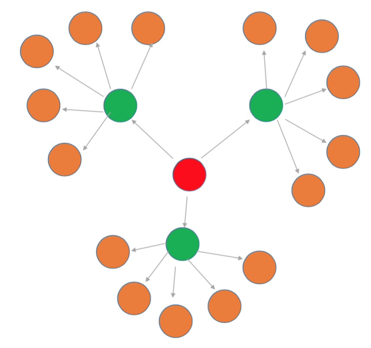

# 自己紹介

## 中西 大輔 (なかにし だいすけ)
- 広島修道大学人文学部
- 社会心理学者
- 好きなこと: SASでproc GLM;
- @daihiko (Twitter, GitHub)
- 「日本に帰りたい」
- [http://ns1.shudo-u.ac.jp/~nakanisi/](http://ns1.shudo-u.ac.jp/~nakanisi/)


# どんな話?

## こんなみんなのためにDiagrammeRはある!

- 意味不明で複雑なポンチ絵を作って研究費をgetしたい。
- 美しいパス図を描いてあの子にアピールしたい。
- Wordで図を描いた時に線が1ピクセルでもはみ出すのは許せない。

## Wordのダサい図



##DiagrammeRの格好いい図

```{r diagrammer, echo=FALSE}
library("DiagrammeR")
grViz("
digraph neato {
  graph [layout = neato]
  node [shape = circle, style = filled, color = grey, label = '']
  node [fillcolor = red]
    a
  node [fillcolor = green]
    b c d
  node [fillcolor = orange]
    edge [color = grey]
      a -> {b c d}
      b -> {e f g h i j}
      c -> {k l m n o p}
      d -> {q r s t u v}
}")
```

# DiagrammeRとは?

## ダイアグラムを作るパッケージ

- ポンチ絵を作ったり、
- パス図を描いたり、
- いろいろ活躍!
- Wordで線のはみ出た汚いダイアグラムでいいのかい?

## DiagrammeRの中身

- Graphviz: *Graph Visualization Software*。AT&Tが開発。DOTと呼ばれるグラフ描画言語からできており、その言語を処理する様々なツールを含んでいます。DOTは高度にカスタマイズ可能で、ラインの色、矢印の形、ノードの形など、あらゆるレイアウトを制御することができます。
- mermaid: mermaidを使うとグラフを描いたり、シーケンスダイアグラムを作成したりすることができます。
- Node and Edge Data Frames: これらの機能はNDFs (node data frames) とEDFs (edge data frames) という特殊化したデータフレームを作成するのに使います。

## DiagrammeRの使い方

- install.packages ("DiagrammeR")
- library ("DiagrammeR")
- 入門用の日本語ドキュメントは現時点ではほとんどありません。
    - 本家 [http://rich-iannone.github.io/DiagrammeR/index.html](http://rich-iannone.github.io/DiagrammeR/index.html)
    - かずたん (日本語) [http://qiita.com/kazutan/items/ec47a2403df9eb817ce0](http://qiita.com/kazutan/items/ec47a2403df9eb817ce0)

#Demos (Pontier)

##単純なダイアグラム (code_A)

```{r simple01}

library("DiagrammeR")
grViz (width = 400, height = 400, "digraph boxes_and_circles {
  graph [overlap = true]
  node [shape = circle] a; b; c; a->c; b->c
}")
```

##単純なダイアグラム (code_B)

```{r simple02}

library("DiagrammeR")
nodes_simple <- create_nodes (nodes = c("a", "b", "c"))
edges_simple <- create_edges (from = c("a","b"), to = c("c","c"))
graph_simple <- create_graph (nodes_df = nodes_simple, edges_df = edges_simple)
render_graph(graph_simple, width = 400, height = 400)

```

##単純なダイアグラム (code_C)

```{r simple03}

library("DiagrammeR")
nodes_simple <- create_nodes (nodes = c("a", "b", "c"))
edges_simple <- create_edges (from = c("a","b"), to = c("c","c"))
graph_simple <- create_graph (nodes_df = nodes_simple, edges_df = edges_simple)
render_graph(graph_simple, output = "vivagraph")

```

##単純なダイアグラム (code_D)

```{r simple04}

library("DiagrammeR")
nodes_simple <- create_nodes (nodes = c("a", "b", "c"))
edges_simple <- create_edges (from = c("a","b"), to = c("c","c"))
graph_simple <- create_graph (nodes_df = nodes_simple, edges_df = edges_simple)
render_graph(graph_simple, output = "visNetwork")

```

##「人はなぜ二日酔いになるのか」

```{r ponchier01, echo=FALSE}

library("DiagrammeR")
grViz("
  digraph boxes_and_circles {
    graph [overlap = true, fontsize = 10]
    node [shape = box, fontname = Helvetica]
      出張
      二日酔い
    node [shape = circle, fontname = Helvetica]
      暑い
      ビール飲みたい
      賢者モード
      研究しないと
      
      暑い->ビール飲みたい
      出張->ビール飲みたい
      ビール飲みたい->二日酔い [label=飲む]
      二日酔い->賢者モード [label=出す]
      賢者モード->研究しないと
      研究しないと->出張
  }
")
```

##「人はなぜ二日酔いになるのか」 (code)

```{r ponchier01_code,eval=FALSE}

library("DiagrammeR")
grViz("
  digraph boxes_and_circles {
    graph [overlap = true, fontsize = 10]
    node [shape = box, fontname = Helvetica]
      出張
      二日酔い
    node [shape = circle, fontname = Helvetica]
      暑い
      ビール飲みたい
      賢者モード
      研究しないと
      
      暑い->ビール飲みたい
      出張->ビール飲みたい
      ビール飲みたい->二日酔い [label=飲む]
      二日酔い->賢者モード [label=出す]
      賢者モード->研究しないと
      研究しないと->出張
  }
")
```

##「人はなぜ二日酔いになるのか」(改善版)

```{r ponchier02, echo=FALSE}

library ("DiagrammeR")
grViz ("
  digraph boxes_and_circles {
    graph [overlap = true, fontsize = 10, layout = neato]
    node [shape = box, fontname = Helvetica]
      出張 [pos='-4,3!']
      二日酔い [pos='0,-2!']
    node [shape = circle, fontname = Helvetica]
      暑い [pos='4,1!']
      ビール飲みたい [pos='0,0!']
      賢者モード [pos='-4,-2!']
      研究しないと [pos='-4,1!']
      
      暑い->ビール飲みたい
      出張->ビール飲みたい
      ビール飲みたい->二日酔い [label=飲む]
      二日酔い->賢者モード [label=出す]
      賢者モード->研究しないと
      研究しないと->出張
  }
")
```

##「人はなぜ二日酔いになるのか」(改善版code)

```{r ponchier02_code, eval=FALSE}

library ("DiagrammeR")
grViz ("
  digraph boxes_and_circles {
    graph [overlap = true, fontsize = 10, layout = neato]
    node [shape = box, fontname = Helvetica]
      出張 [pos='-4,3!']
      二日酔い [pos='0,-2!']
    node [shape = circle, fontname = Helvetica]
      暑い [pos='4,1!']
      ビール飲みたい [pos='0,0!']
      賢者モード [pos='-4,-2!']
      研究しないと [pos='-4,1!']
      
      暑い->ビール飲みたい
      出張->ビール飲みたい
      ビール飲みたい->二日酔い [label=飲む]
      二日酔い->賢者モード [label=出す]
      賢者モード->研究しないと
      研究しないと->出張
  }
")
```

#Demos (Regression)

##Risk Factors Associated with Low Infant Birth Weight

The birthwt data frame has 189 rows and 10 columns. The data were collected at Baystate Medical Center, Springfield, Mass during 1986.

- low: indicator of birth weight less than 2.5 kg.
- age: mother's age in years.
- smoke: smoking status during pregnancy.

##ロジスティック回帰分析

[http://d.hatena.ne.jp/dichika/20151208/p1](http://d.hatena.ne.jp/dichika/20151208/p1)

```{r logistic, echo=FALSE}
library ("broom")
library ("DiagrammeR")
res_glm <- glm(data=MASS::birthwt, low~age+smoke, family="binomial")
(res_glm_tidy <- tidy(res_glm, exponentiate = TRUE, conf.int = TRUE))
nodes <- create_nodes(nodes = res_glm_tidy$term)
edges <- create_edges(from = res_glm_tidy$term, to = rep(as.character(res_glm$formula[[2]]),
                                        nrow(nodes)), label=round(res_glm_tidy$estimate, 2))
graph <- create_graph(nodes_df = nodes, edges_df = edges)
render_graph(graph)
```

##ロジスティック回帰 (code)

```{r logistic_code, eval=FALSE}
library ("broom")
library ("DiagrammeR")
res_glm <- glm(data=MASS::birthwt, low~age+smoke, family="binomial")
(res_glm_tidy <- tidy(res_glm, exponentiate = TRUE, conf.int = TRUE))
nodes <- create_nodes(nodes = res_glm_tidy$term)
edges <- create_edges(from = res_glm_tidy$term, to = rep(as.character(res_glm$formula[[2]]),
                                        nrow(nodes)), label=round(res_glm_tidy$estimate, 2))
graph <- create_graph(nodes_df = nodes, edges_df = edges)
render_graph(graph)
```


##Edgar Anderson's Iris Data

This famous (Fisher's or Anderson's) iris data set gives the measurements in centimeters of the variables sepal length and width and petal length and width, respectively, for 50 flowers from each of 3 species of iris. The species are Iris setosa, versicolor, and virginica.

```{r iris, echo=FALSE}
pairs(iris[1:4], main = "Iris Data setosa/versicolor/virginica", pch = 21, bg = c("red", "green3", "blue")[unclass(iris$Species)]) 
```

##重回帰分析

```{r liner, echo=FALSE}
library ("broom")
library ("DiagrammeR")

lm_result<-lm(data=iris, Sepal.Length~Sepal.Width+Petal.Length+Petal.Width)
(lm_result_tidy<-tidy(lm_result,exponentiate = FALSE, conf.int = TRUE))
nodes <- create_nodes(nodes = lm_result_tidy$term)
edges <- create_edges(from = lm_result_tidy$term, to = rep(as.character(lm_result$terms[[2]]),
                                        nrow(nodes)), label=round(lm_result_tidy$estimate, 2))
graph1 <- create_graph(nodes_df = nodes, edges_df = edges)
render_graph(graph1)
```

##重回帰分析 (code)

```{r liner_code, eval=FALSE}
library ("broom")
library ("DiagrammeR")

lm_result<-lm(data=iris, Sepal.Length~Sepal.Width+Petal.Length+Petal.Width)
(lm_result_tidy<-tidy(lm_result,exponentiate = FALSE, conf.int = TRUE))
nodes <- create_nodes(nodes = lm_result_tidy$term)
edges <- create_edges(from = lm_result_tidy$term, to = rep(as.character(lm_result$terms[[2]]),
                                        nrow(nodes)), label=round(lm_result_tidy$estimate, 2))
graph1 <- create_graph(nodes_df = nodes, edges_df = edges)
render_graph(graph1)
```

#Demos (Sequence)

##Ticket sale (シーケンス図)

[http://rich-iannone.github.io/DiagrammeR/mermaid.html](http://rich-iannone.github.io/DiagrammeR/mermaid.html)

```{r ticket, echo=FALSE}
mermaid("
sequenceDiagram
  customer->>ticket seller: ask ticket
  ticket seller->>database: seats
  alt tickets available
    database->>ticket seller: ok
    ticket seller->>customer: confirm
    customer->>ticket seller: ok
    ticket seller->>database: book a seat
    ticket seller->>printer: print ticket
  else sold out
    database->>ticket seller: none left
    ticket seller->>customer: sorry
  end
")
```

##Ticket sale (シーケンス図code)

[http://rich-iannone.github.io/DiagrammeR/mermaid.html](http://rich-iannone.github.io/DiagrammeR/mermaid.html)

```{r ticket_code, eval=FALSE}
mermaid("
sequenceDiagram
  customer->>ticket seller: ask ticket
  ticket seller->>database: seats
  alt tickets available
    database->>ticket seller: ok
    ticket seller->>customer: confirm
    customer->>ticket seller: ok
    ticket seller->>database: book a seat
    ticket seller->>printer: print ticket
  else sold out
    database->>ticket seller: none left
    ticket seller->>customer: sorry
  end
")
```

##論文投稿と査読の流れ (シーケンス図)
```{r submission, echo=FALSE}
mermaid("
sequenceDiagram
  投稿者->>編集委員会: 論文投稿
  編集委員会->>主査: 審査者決定依頼
  主査->>審査者: 審査依頼
  審査者->>主査: 審査報告
  主査->>編集委員会: 審査報告
  alt 掲載可
    主査->>投稿者: accept通知
  else 掲載不可
    主査->>投稿者: reject通知
  end
")
```

##論文投稿と査読の流れ (シーケンス図code)
```{r submission_code, eval=FALSE}
mermaid("
sequenceDiagram
  投稿者->>編集委員会: 論文投稿
  編集委員会->>主査: 審査者決定依頼
  主査->>審査者: 審査依頼
  審査者->>主査: 審査報告
  主査->>編集委員会: 審査報告
  alt 掲載可
    主査->>投稿者: accept通知
  else 掲載不可
    主査->>投稿者: reject通知
  end
")
```